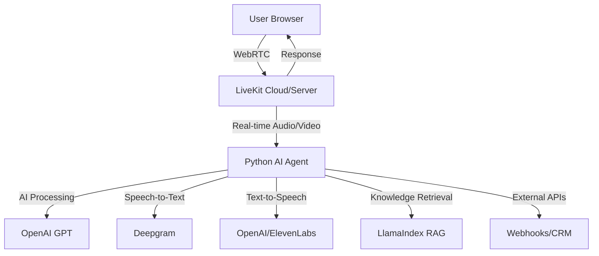

# Kno2gether AI Agent Projects Analysis

## Overview

This workspace contains two interconnected AI-powered projects developed by Kno2gether (YouTube channel focused on AI and automation). Both projects demonstrate the integration of **LiveKit** real-time communication with AI agents for different use cases.

---

## 🏗️ Project 1: Kno2gether LiveKit Playground (Frontend)

### **Purpose**
A **Next.js web application** that serves as the frontend interface for AI-powered dental assistance, providing real-time video/audio communication between users and AI agents.

### **Architecture**

#### **Tech Stack**
- **Frontend Framework**: Next.js 14 with TypeScript
- **UI/Styling**: React 18 + Tailwind CSS + Framer Motion
- **Real-time Communication**: LiveKit React Components
- **State Management**: Custom React hooks
- **Animation**: Framer Motion for smooth transitions

#### **Key Components**
```
├── src/
│   ├── components/
│   │   ├── playground/          # Main application interface
│   │   ├── chat/               # Chat functionality  
│   │   ├── button/             # Reusable button components
│   │   ├── config/             # Configuration panels
│   │   └── toast/              # Notification system
│   ├── hooks/
│   │   ├── useConnection.tsx    # LiveKit connection management
│   │   ├── useConfig.tsx       # App configuration
│   │   └── useTrackVolume.tsx  # Audio volume tracking
│   ├── pages/
│   │   ├── index.tsx           # Main landing page
│   │   ├── _app.tsx            # App wrapper
│   │   └── api/                # API routes for token generation
│   └── transcriptions/         # Real-time transcription components
```

### **Core Features**
- ✅ **Real-time Video/Audio Communication** via LiveKit
- ✅ **AI Chat Interface** for dental queries
- ✅ **Live Transcription** of conversations
- ✅ **Responsive Design** with animated backgrounds
- ✅ **Token-based Authentication** for secure connections
- ✅ **Device Selection** (camera/microphone)
- ✅ **Connection Management** with automatic reconnection

### **Dependencies**
```json
{
  "@livekit/components-react": "^2.6.0",
  "@livekit/components-styles": "^1.1.1", 
  "livekit-client": "^2.5.1",
  "livekit-server-sdk": "^2.6.1",
  "next": "^14.0.4",
  "framer-motion": "^10.16.16"
}
```

---

## 🤖 Project 2: Kno2gether WebRTC Agent (Backend)

### **Purpose**
A **Python-based AI agent system** powered by LiveKit that handles real-time voice interactions, appointment booking, and provides specialized AI assistance for various domains (dental, pizza ordering, salon services).

### **Architecture**

#### **Tech Stack**
- **Backend Framework**: Python with LiveKit Agents
- **AI/LLM**: OpenAI GPT models
- **Speech Processing**: Deepgram (STT) + OpenAI/ElevenLabs (TTS)
- **Voice Activity Detection**: Silero VAD
- **RAG System**: LlamaIndex for knowledge retrieval
- **Deployment**: Docker + Docker Compose

#### **Project Structure**
```
├── agent.py                    # Main agent entry point
├── WebRTCDemooAgent.py         # Demo agent implementation
├── assistant/                  # Modular assistant components
│   ├── voice_assistant.py      # Voice assistant factory
│   ├── functions.py           # AI callable functions
│   ├── chat_manager.py        # Chat context management
│   └── utils.py               # Utility functions
├── tts/                       # Text-to-Speech engines
│   ├── openai_tts.py          # OpenAI TTS integration
│   └── elevenlabs_tts.py      # ElevenLabs TTS integration
├── RAG/                       # Retrieval Augmented Generation
│   ├── LlamaIndexChatEngineRAGAgent.py
│   ├── LlamaIndexQueryEngineRAGAgent.py
│   └── dental_data/           # Knowledge base for dental domain
├── HumanoidAgent/             # Specialized pizza ordering agent
├── CompletelyFreeAgent/       # Salon services agent
└── requirements.txt           # Python dependencies
```

### **Core Features**

#### **🎯 Multi-Domain AI Agents**
1. **Dental Assistant** (`agent.py`, `KnolabsDentalAssistant.py`)
   - Provides dental advice and consultation
   - Books appointments via webhook integration
   - Checks appointment status via CRM integration

2. **Pizza Ordering Agent** (`HumanoidAgent/humanoid_agent.py`)
   - RAG-powered knowledge base for pizza company data
   - Order management system integration
   - Custom end-of-utterance detection

3. **Salon Services Agent** (`CompletelyFreeAgent/free_salon_agent.py`)
   - Appointment booking for salon services
   - Fallback mechanisms for complex queries

#### **🔧 Technical Capabilities**
- ✅ **Real-time Voice Processing** (STT/TTS/VAD)
- ✅ **Function Calling** for external API integration
- ✅ **Webhook Integration** for appointment booking
- ✅ **CRM Integration** for customer management
- ✅ **RAG System** for domain-specific knowledge retrieval
- ✅ **Multi-TTS Support** (OpenAI, ElevenLabs)
- ✅ **Docker Deployment** with environment configuration

### **Dependencies**
```txt
livekit-agents>=0.12.3
livekit-plugins-deepgram>=0.6.15
livekit-plugins-openai[vertex]>=0.10.10
livekit-plugins-elevenlabs
livekit-plugins-rag>=0.2.3
llama-index-core
transformers
torch
```

---

## 🔗 **How They Connect**

### **Connection Architecture**


### **Integration Points**

1. **LiveKit as Communication Layer**
   - **Frontend** uses `@livekit/components-react` for UI
   - **Backend** uses `livekit-agents` for real-time processing
   - Both share same LiveKit room/token authentication

2. **Shared Configuration**
   - Both projects require same environment variables:
     - `LIVEKIT_URL`
     - `LIVEKIT_API_KEY` 
     - `LIVEKIT_API_SECRET`
     - `OPENAI_API_KEY`

3. **Communication Flow**
   ```
   User (Frontend) → LiveKit Room → Python Agent → AI Processing → Response → LiveKit → User
   ```

### **Deployment Relationship**
- **Frontend**: Deployed as Next.js app (Vercel/Netlify)
- **Backend**: Deployed as Python service (Docker/Cloud)
- **LiveKit**: Can use LiveKit Cloud or self-hosted server

---

## 🚀 **Key Features Comparison**

| Feature | Frontend (Playground) | Backend (Agent) |
|---------|----------------------|-----------------|
| **Real-time Communication** | ✅ WebRTC UI Components | ✅ Agent Processing |
| **AI Integration** | ❌ (Relies on backend) | ✅ OpenAI GPT |
| **Speech Processing** | ❌ (Browser audio only) | ✅ Deepgram + TTS |
| **Function Calling** | ❌ | ✅ Appointment booking, CRM |
| **RAG System** | ❌ | ✅ LlamaIndex knowledge base |
| **Multi-Domain Support** | ❌ | ✅ Dental, Pizza, Salon |
| **Deployment** | Static/SSR | Docker containers |

---

## 🎯 **Use Cases Demonstrated**

### **1. Dental Assistant**
- **Frontend**: Provides video consultation interface
- **Backend**: AI-powered dental advice with appointment booking

### **2. Pizza Ordering**
- **Frontend**: Voice-based ordering interface  
- **Backend**: RAG-powered menu knowledge + order processing

### **3. Salon Services**
- **Frontend**: Customer service chat interface
- **Backend**: Appointment scheduling with fallback handling

---

## 🔧 **Technical Highlights**

### **Frontend Innovation**
- **Framer Motion** animations for smooth UX
- **LiveKit React hooks** for connection management
- **Responsive design** with Tailwind CSS
- **Real-time transcription** display

### **Backend Innovation**
- **Modular agent architecture** for different domains
- **RAG integration** with LlamaIndex
- **Multi-TTS support** for voice variety
- **Function calling** for external integrations
- **Docker deployment** for scalability

---

## 📝 **Summary**

These projects together demonstrate a **complete AI agent ecosystem**:

- **Frontend**: Modern React/Next.js interface for user interaction
- **Backend**: Sophisticated Python AI agents with domain expertise
- **Integration**: LiveKit provides seamless real-time communication bridge
- **Scalability**: Docker deployment + modular architecture
- **Flexibility**: Multiple AI personalities for different business domains

The combination showcases how to build **production-ready AI assistants** that can handle real-time voice/video communication while providing domain-specific intelligence and external system integration.