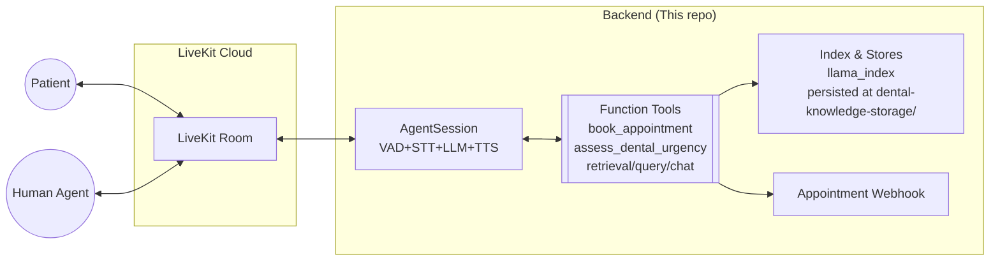
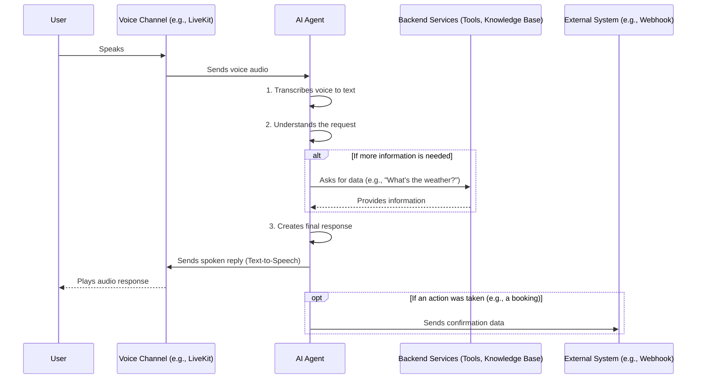

# Oris AI Backend Architecture

This document describes the architecture of the Python backend in this repository (`oris-ai-backend`). It covers both high‑level and low‑level design, data flows, and deployment topology.

Scope: Backend only. The README references a Next.js frontend, but it is not part of this workspace; the backend integrates with LiveKit for real‑time voice/AI interactions.

## High‑level architecture

At a glance, the backend is a voice-enabled AI assistant for dental consultation that uses Retrieval‑Augmented Generation (RAG) over a local knowledge base. It runs as a LiveKit Agent that joins a LiveKit Room and provides speech↔text↔LLM↔speech interactions.

Key capabilities:

- Voice pipeline: VAD → STT → LLM (with tool calls) → TTS
- RAG knowledge base: LlamaIndex with persisted vector store built from files in `dental_data/`
- Tooling: Appointment booking webhook, urgency triage, knowledge retrieval/chat/query
- Providers: Google Gemini/OpenAI LLM, Deepgram STT, Google/ElevenLabs/OpenAI TTS
- Runtime: CLI worker process started with an agent entrypoint; containerized for Render/Railway/Docker

### System context (Mermaid)

### Main components

- LiveKit Agent runtime
  - AgentSession pipeline with: `silero.VAD`, `deepgram.STT`, `llm` (Google/OpenAI), `tts` (Google/ElevenLabs/OpenAI)
  - Room subscription: `AutoSubscribe.AUDIO_ONLY`
- LLM + Tools orchestration
  - Instructions prompt encodes behavior and compliance rules
  - Tool calls for booking, urgency assessment, and RAG queries
- RAG knowledge base
  - Built from `dental_data/` on first run
  - Persisted under `dental-knowledge-storage/` (vector/doc/index stores)
  - Three agent variants, differing in how they use RAG:
    - RetrievalEngineRAGAgent: returns top‑k contexts (retriever)
    - QueryEngineRAGAgent: returns synthesized answer (query engine)
    - ChatEngineRAGAgent: returns conversation‑aware answer (chat engine)
- Integrations
  - Appointment webhook via `requests.post` to `WEBHOOK_URL`
  - Optional SIP bridging to human agent via LiveKit SIP (if configured)

### Deployment topology

- Local: `python RetrievalEngineRAGAgent.py dev` (or the other agents)
- Docker: `Dockerfile`, `docker-compose.yml`
- Managed: `render.yaml`, `railway.json`

Notes:

- `docker-compose.yml` and the Dockerfile include a healthcheck hitting `GET /health`. No HTTP server is currently implemented in code; see “Observability & health” for options.

## Low‑level design

### Source layout

- `RetrievalEngineRAGAgent.py` — Agent using LlamaIndex retriever (top‑k nodes → context string)
- `QueryEngineRAGAgent.py` — Agent using LlamaIndex query engine (direct synthesized answer)
- `ChatEngineRAGAgent.py` — Agent using LlamaIndex chat engine (contextual chat answers)
- `dental_data/` — Markdown sources for the knowledge base
- `dental-knowledge-storage/` — Persisted index/vector/doc stores
- `test_rag.py` — Local tester for RAG retrieval quality
- `test_all_agents.py` — Smoke tests that each agent module imports and exposes `entrypoint`

### Initialization flow (shared across agents)

1. `dotenv.load_dotenv()` loads environment variables.
2. Configure embeddings: `Settings.embed_model = GoogleGenAIEmbedding('text-embedding-004')` (uses `GOOGLE_API_KEY`).
3. RAG index init:
   - If `./dental-knowledge-storage` doesn’t exist, load from `dental_data/` and persist.
   - Else, load existing storage via `StorageContext.from_defaults`.
4. Create the appropriate LlamaIndex interface per agent:
   - Retrieval: `index.as_retriever(similarity_top_k=3)` (dynamic per call)
   - Query: `index.as_query_engine()`
   - Chat: `index.as_chat_engine(chat_mode=ChatMode.CONTEXT)`

### Agent runtime pipeline

### Tools (function contracts)

- `book_appointment(email: str, name: str) -> { result: str }`
  - Validates email; POSTs to `WEBHOOK_URL` with JSON `{ email, name }`.
  - Errors are caught; returns a user‑friendly `result` message.
- `assess_dental_urgency(symptoms: str) -> { result: str }`
  - Simple keyword check; returns either `call_human_agent` or guidance text.
- RAG functions (variant‑specific):
  - Retrieval: `retrieval_dental_info(query: str) -> { result: str }` returns concatenated top‑k node contents.
  - Query: `query_dental_knowledge(query: str) -> { result: str }` returns synthesized QA answer.
  - Chat: `chat_with_dental_knowledge(query: str) -> { result: str }` returns a conversationally coherent answer.

All tool functions are decorated with `@function_tool()` and are invoked by the LLM when appropriate.

### Provider selection logic

- LLM
  - If `GOOGLE_API_KEY` is present and not the placeholder → `google.LLM(model="gemini-2.0-flash-001")`
  - Else → `openai.LLM()`
- TTS
  - If `ELEVENLABS_API_KEY` present → `elevenlabs.TTS(voice_id)`
  - Else if `GOOGLE_API_KEY` present → `google.TTS()`
  - Else → `openai.TTS()`
- STT: `deepgram.STT()`
- VAD: `silero.VAD.load()`

### Session lifecycle

- `await ctx.connect(auto_subscribe=AutoSubscribe.AUDIO_ONLY)`
- Construct `Agent(instructions=..., tools=..., chat_ctx=...)`
- `session = AgentSession(vad, stt, llm, tts)`
- `await session.start(agent, room=ctx.room)`
- `session.say(...)` sends greeting and other follow‑ups
- Room event hook:
  - `@ctx.room.on("participant_disconnected")` → speak a handover message
- Optional: SIP dial‑out via LiveKit API if configured (`SIP_TRUNK_ID`, etc.)

### Data and storage

- Source docs: `dental_data/*.md`
- Persisted LlamaIndex artifacts: `dental-knowledge-storage/`
  - `docstore.json`, `graph_store.json`, `index_store.json`, `*_vector_store.json`
- No external database is used; everything is local JSON storage.

### Error handling

- Network calls (webhook) wrapped with `try/except requests.RequestException`
- RAG calls wrapped with generic `try/except` to return safe fallback text
- LLM/audio provider selection falls back progressively (Google → OpenAI)

### Observability & health

- Logging is basic (`print` statements).
- `docker-compose.yml`/Dockerfile healthchecks query `GET /health`, but no HTTP server is defined. Options:
  - Add a tiny HTTP health endpoint (e.g., FastAPI/Flask) and run alongside the agent.
  - Or update healthcheck to a script that verifies process liveness and provider reachability.

### Configuration

Environment variables (subset; see `render.yaml` for full list):

- LiveKit: `LIVEKIT_URL`, `LIVEKIT_API_KEY`, `LIVEKIT_API_SECRET`
- AI Providers: `GOOGLE_API_KEY`, `ELEVENLABS_API_KEY`, `ELEVENLABS_VOICE_ID`
- Integrations: `WEBHOOK_URL`
- Telephony (optional): `SIP_TRUNK_ID`, `HUMAN_AGENT_PHONE`

### Security considerations

- Secrets are provided via environment variables; do not commit them.
- Webhook: ensure HTTPS and authenticate as needed (e.g., shared secret or token).
- Validate and sanitize all user inputs before sending to downstream systems.

### Testing & local verification

- `test_rag.py` exercises RAG retrieval and prints previews of matched nodes.
- `test_all_agents.py` imports each agent and checks the presence of `entrypoint` and core functions.

### Tradeoffs between agent variants

- Retrieval: Highest transparency and control; model reads raw context; places more burden on the LLM prompt.
- Query Engine: Synthesizes answers server‑side; simpler LLM prompt, less transparency.
- Chat Engine: Maintains conversational state and context windows; best for multi‑turn knowledge queries.

### Future enhancements (suggested)

- Replace `print` with structured logging + log levels
- Implement real `/health` endpoint or adjust healthcheck
- Add metrics (latency, tool call counts, retrieval quality)
- Expand tests to integration/e2e with mocked providers
- Optional: swap vector DB to an external store for scaling

---

Examples

- Start retrieval agent locally: `python RetrievalEngineRAGAgent.py dev`
- Persisted index is auto‑created on first run from `dental_data/`
